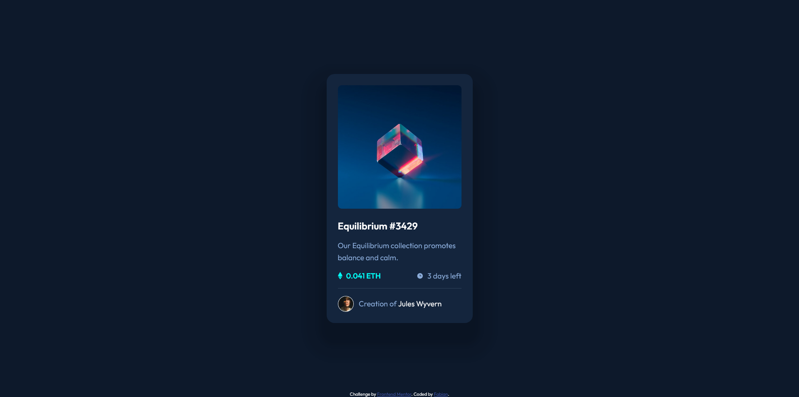

# Frontend Mentor - NFT preview card component solution

This is a solution to the [NFT preview card component challenge on Frontend Mentor](https://www.frontendmentor.io/challenges/nft-preview-card-component-SbdUL_w0U). Frontend Mentor challenges help you improve your coding skills by building realistic projects. 

## Table of contents

- [Overview](#overview)
  - [The challenge](#the-challenge)
  - [Screenshot](#screenshot)
  - [Links](#links)
- [My process](#my-process)
  - [Built with](#built-with)
  - [What I learned](#what-i-learned)
  - [Continued development](#continued-development)
- [Author](#author)

## Overview

### The challenge

Users should be able to:

- View the optimal layout depending on their device's screen size
- See hover states for interactive elements

### Screenshot



### Links

- Solution URL: [Add solution URL here](https://github.com/FabianAlv/frontend-mentor-challenge-nft-preview-card-component)
- Live Site URL: [Add live site URL here](https://fabianalv.github.io/frontend-mentor-challenge-nft-preview-card-component/)

## My process

### Built with

- Semantic HTML5 markup
- Flexbox
- Mobile-first workflow

### What I learned

In this project I learned three things that are pretty cool and that most likely I'll use in other cases. They all come from the same code section of html.

```html
<a href="#" class="card__images-link">
  <div class="card__images-link__hover-img-container">
    
  </div>
</a>
```

First thing learned: Containers with display: flex set align-items: stretch by default, and this was stretching the icon-view.svg to the full size of the container, to fix this just update the align-items property to something different.

```css
.card__images-link__hover-img-container {
  align-items: center;
  display: flex;
}
```

Second thing learned: In this example I added the container for the icon-view.svg inside the anchor tag, elements inside the achor tag are not hoverable because the anchor tag is on top of them (the anchor tag is the one with the hover property accessible), so to make elements inside hoverable we can access them by first using the anchor tag hover property and then referencing the element inside the anchor tag.

```css
.card__images-link__hover-img-container {
  visibility: hidden;
}

.card__images-link:hover .card__images-link__hover-img-container {
  visibility: visible;
}
```

Third thing learned: You can use the aspec-ratio property to make a container with a % width have the same length in height in a really simple way (I am pretty sure the other way around also applys)

```css
.card__images-link {
  aspect-ratio: 1;
  width: 100%;
}
```

### Continued development

I want to improve my knowledge on images and background images.

## Author

- Frontend Mentor - [@FabianAlv](https://www.frontendmentor.io/profile/FabianAlv)
